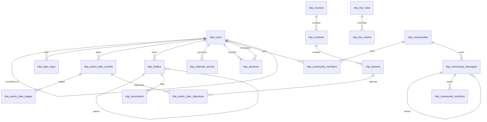

# RFC 001 — Schema Postgres da plataforma NBP

| Campo | Valor |
| --- | --- |
| Status | Aceite (aplicado no projeto Supabase `dotyjpdafxwkmmgmxlrz`) |
| Data | 17 de setembro de 2026 |
| Autores | Equipa NBP |
| Área | Dados / Postgres / RLS |
| Substitui | Schema v1 (`nbp_members` + `nbp_profiles`, documentos e calendário só globais) |

## 1. Resumo

A plataforma NBP deixa o protótipo em `localStorage` (`nbp-admin`) e passa a ter um modelo relacional no Supabase. Há **um utilizador** com **role** (`admin`, `consultor`, `membro`). Cada membro tem plano de ação por mês, documentos, calendário pessoal, reuniões 1:1 e gamificação. O catálogo (cursos, Talks, lives da comunidade) é global. A comunidade permite várias salas, threads e reações.

Prefixo de tabelas: `nbp_`, schema `public`, sem misturar com as tabelas Instagram já existentes no mesmo projeto.

## 2. Motivação

O portal (`platformV2.html`, `action-planV2.html`, etc.) e o backoffice (`admin/`) descrevem o mesmo produto, mas cada um tem mocks próprios. O schema v1 tentou copiar só o CMS do admin e ficou curto:

- “Membro” e “login” eram duas entidades (`nbp_members` / `nbp_profiles`).
- Documentos e calendário eram partilhados por toda a gente.
- Faltavam roles de consultor, comunidade, 1:1 e ranking.

Este RFC fixa o modelo de domínio antes de ligar o HTML ao cliente Supabase.

## 3. Objetivos e não-objetivos

**Entra**

- Persistência do que o MVP da plataforma mostra: identidade, plano, documentos pessoais, calendário (pessoal + lives), cursos, Talks, 1:1, comunidade, streak/ranking.
- RLS por role.
- Membros criados no backoffice **antes** de terem conta Auth (`auth_id` nullable).

**Não entra**

- Ligar `admin/*.html` ou o portal à API.
- Buckets de Storage (só coluna `url`).
- Progresso de aula (`p` 0–100 do player), suporte, faturação, fotos de networking em blob.
- Biblioteca Drive NBP partilhada (foi descontinuada neste recorte: documentos são por utilizador).

## 4. Conceitos

```
Utilizador (role)
  ├── Plano de ação  →  mês  →  etapas, objetivos, quadro (tela)
  ├── Documentos     →  pastas aninhadas  →  links
  ├── Calendário pessoal
  ├── Reuniões 1:1 (com um consultor)
  └── Login days (streak)

Catálogo global
  ├── Cursos → módulos → aulas
  ├── Mafra Talks
  └── Lives (regras terça/quinta + overrides)

Comunidade
  └── comunidades → membros → mensagens (threads) → reações
```

**Role** não é tabela: é coluna em `nbp_users`.

| Role | Quem | Acesso típico |
| --- | --- | --- |
| `admin` | Equipa NBP (ex. João Mafra) | CRUD em tudo |
| `consultor` | Mentora/consultora (ex. Marta Nunes) | Membros com `consultant_id` apontando para si; sessões 1:1; planos desses membros |
| `membro` | Cliente | Próprios dados + catálogo publicado + comunidades onde está |

## 5. Decisões

1. **Um `nbp_users`, não members+profiles.** `id` é da aplicação; `auth_id` liga a `auth.users` quando a pessoa cria conta. No signup, o trigger `on_auth_user_created` faz match por email ou insere um membro novo.
2. **Mês do plano em calendário 1–12.** O JS do protótipo usa `planKey(y, m)` 0-based (`"2026-7"` = agosto). Na BD: `year = 2026`, `month = 8`.
3. **Quadro em JSON.** `tela` e `viewport` ficam `jsonb` no mês — o admin não edita canvas. Etapas e objetivos são tabelas (CRUD e reorder).
4. **Documentos por utilizador.** Pasta com `parent_id` (árvore) e ficheiros com `url` opcional. Sem árvore global tipo Drive NBP neste MVP.
5. **Dois calendários.** Lives da comunidade (`nbp_live_rules` / `nbp_live_events`) iguais às terças/quintas do backoffice; eventos pessoais em `nbp_calendar_events`. As 1:1 vivem em `nbp_sessions` e o cliente pode uni-las no UI pelo `starts_at`.
6. **Cursos acima dos módulos.** Tutorias e Accountability são cursos `kind` `tutoria` / `accountability`; Fundações…Vendas são módulos de um curso `formacao`.
7. **Ranking derivado.** Vista `nbp_member_stats` (security definer): tarefas `done`, `fill_pct` do último mês, `login_streak`, `row_number()`. Streak atualiza-se ao inserir em `nbp_login_days`.
8. **Códigos do protótipo.** `code text unique` (`m-roque`, `m2.4`, `mod-2`) para o seed e para não reescrever IDs no HTML mais tarde.

## 6. Modelo relacional



Fonte de verdade SQL: [`supabase/migrations/20260917140000_nbp_schema_v2.sql`](../supabase/migrations/20260917140000_nbp_schema_v2.sql) e [`supabase/migrations/20260917140001_nbp_rls_v2.sql`](../supabase/migrations/20260917140001_nbp_rls_v2.sql).

## 7. Tabelas

Convenção: `id uuid PK default gen_random_uuid()`, `created_at` / `updated_at timestamptz` (exceto tabelas de junção e `nbp_login_days`).

### 7.1 Identidade

**`nbp_users`**

| Coluna | Tipo | Notas |
| --- | --- | --- |
| `auth_id` | uuid unique, FK `auth.users` | Null até haver login |
| `code` | text unique | IDs do protótipo |
| `role` | text | `admin` \| `consultor` \| `membro` |
| `full_name`, `email` | text | `email` unique |
| `company`, `city`, `phone`, `instagram`, `bio`, `avatar_url` | text | Perfil |
| `sector` | text | `mkt`, `marca`, `com`, `dados`, `saude`, `foto`, `va`, `desp` |
| `gender` | text | `m` \| `f` (silhueta do portal) |
| `membership_status` | text | `ativo` \| `inativo` |
| `consultant_id` | uuid FK self | Consultor do membro |
| `login_streak`, `last_login_on` | int, date | Cache do streak |

**`nbp_login_days`** — `(user_id, on_date)` unique. Trigger `nbp_touch_login_streak` incrementa streak em dias consecutivos.

### 7.2 Catálogo global

**`nbp_courses`** — `kind`: `formacao` \| `tutoria` \| `accountability`.

**`nbp_modules`** — `course_id`, `module_number` 1–4 ou null, `color` / `color_light`.

**`nbp_lessons`** — `duration_label` (`12 min`), `session_label` (`18 ago`), `status` `rascunho` \| `publicado`, `video_url`.

**`nbp_talks`** — episódios Mafra Talks; `featured` para o herói da semana; `status` `publicado` \| `arquivo`.

### 7.3 Documentos (por user)

**`nbp_folders`** — `user_id`, `parent_id` (restrict no delete do pai), `name`, `sort_order`.

**`nbp_documents`** — `folder_id`, `name`, `file_kind` (`doc` \| `gdoc` \| `xls` \| `gsheet` \| `pdf` \| `link`), `url` nullable.

### 7.4 Calendário

**`nbp_live_rules`** — `weekday` 0–6 (= `Date.getDay()`), `hour` (`18h00`), `kind` tutoria/accountability, `rotation text[]`.

**`nbp_live_events`** — `oneoff` (sem `rule_id`), `override` ou `cancel` (com `rule_id`). `kind`: `tutoria` \| `growth` \| `scale` \| `presencial`.

**`nbp_calendar_events`** — agenda pessoal: `user_id`, `starts_at`, `title`, `kind`.

### 7.5 Plano de ação

**`nbp_action_plan_months`** — unique `(user_id, year, month)`. Métricas: `mrr`, `rec`, `nov`, `act`, `chu`, `lea`. Desafio: `title`, `subtitle`, `flag_main`, `flag_prefix`, `flag_target`, `fill_pct`. Quadro: `tela jsonb`, `viewport jsonb` (`{ox, oy, z}`).

Formas em `tela` (protótipo): `t` = `ret` \| `eli` \| `set` \| `lap` \| `txt`, mais `x,y,w,h,c,s` / `txt` / `pts`.

**`nbp_action_plan_stages`** — ações/etapas: `position`, `name`, `status` `done` \| `current` \| `locked`, `subtitle`. Uma `current` é regra de UI, não de BD.

**`nbp_action_plan_objectives`** — `title`, `"column"` `none` \| `todo` \| `done`, `lesson_id` opcional, `position`.

### 7.6 Reuniões 1:1

**`nbp_sessions`** — `member_id`, `consultant_id`, `session_number`, `starts_at`, `duration_min`, `status` `scheduled` \| `done` \| `cancelled`, `summary`, `recording_url`, `tasks_count`.

### 7.7 Comunidade

**`nbp_communities`** — `slug`, `name`, `description`.

**`nbp_community_members`** — PK `(community_id, user_id)`.

**`nbp_community_messages`** — `parent_id` para threads; `title` no post raiz; `body`.

**`nbp_community_reactions`** — unique `(message_id, user_id, emoji)`.

### 7.8 Vista de gamificação

**`nbp_member_stats`** — membros ativos: `user_id`, `full_name`, `avatar_url`, `login_streak`, `tasks_completed`, `challenge_pct` (último mês), `rank`.

## 8. Autenticação e RLS

Helpers (`security definer`): `nbp_current_user_id()`, `nbp_is_admin()`, `nbp_is_consultor()`, `nbp_sees_user(uuid)` (eu, os meus membros se sou consultor, ou tudo se sou admin).

| Superfície | Membro | Consultor | Admin |
| --- | --- | --- | --- |
| Catálogo (cursos, lives) | SELECT; aulas/talks só `publicado` | SELECT incluindo rascunhos | CRUD |
| Próprio user / docs / cal pessoal / plano SELECT | Sim | Membros atribuídos | Tudo |
| Escrever mês/etapas do plano | Não | Membros atribuídos | Sim |
| Mover objetivos (kanban) | UPDATE no próprio mês | Idem + atribuídos | Sim |
| Comunidade | Join próprio; mensagens/reacts nas salas em que está | Ler; admin gere salas | CRUD |
| 1:1 | SELECT das próprias | CRUD onde é `consultant_id` | CRUD |
| Ranking (`nbp_member_stats`) | SELECT (vista definer) | SELECT | SELECT |

Anon: sem grants úteis nas `nbp_*`. Promoção a admin:

```sql
update public.nbp_users set role = 'admin' where email = 'joao@nbp.pt';
```

## 9. Alternativas rejeitadas

| Opção | Porquê não |
| --- | --- |
| `nbp_users.id` = `auth.users.id` | Impede criar o membro no backoffice antes do convite. |
| Documentos globais (v1) | O produto pede pasta+links **por pessoa**. |
| Só calendário pessoal | As lives de terça/quinta são da comunidade inteira. |
| `desafio` e etapas em jsonb | O backoffice já faz lista editável e reorder. |
| Tabela `nbp_roles` | Três valores estáveis; check na coluna chega. |
| Ranking escrito à mão | Deriva de objetivos + streak; evita drift. |

## 10. Ficheiros e rollout

| Ficheiro | Função |
| --- | --- |
| [`supabase/migrations/20260917120000_nbp_schema.sql`](../supabase/migrations/20260917120000_nbp_schema.sql) | v1 (histórico; o remoto já a dropou) |
| [`supabase/migrations/20260917140000_nbp_schema_v2.sql`](../supabase/migrations/20260917140000_nbp_schema_v2.sql) | Drop v1 + tabelas v2 |
| [`supabase/migrations/20260917140001_nbp_rls_v2.sql`](../supabase/migrations/20260917140001_nbp_rls_v2.sql) | Helpers, trigger Auth, policies |
| [`supabase/seed.sql`](../supabase/seed.sql) | Dados do protótipo (Roque, cursos, Talks, lives, 1:1, comunidade). **Não aplicar** no projeto partilhado com Instagram sem acordo. |

HTML do protótipo continua a ler mocks. Próximo passo de produto: cliente Supabase no backoffice e no portal, com o mesmo `code` que o seed.

## 11. Trabalho futuro

- Progresso de aulas por membro.
- Storage (avatares, PDFs, gravações 1:1).
- Biblioteca NBP partilhada *além* das pastas pessoais, se voltar a ser requisito.
- Faturação e suporte.
- Índice único parcial: no máximo um Talk `featured` publicado.
- Garantir no SQL que `consultant_id` aponta para `role = 'consultor'`.
